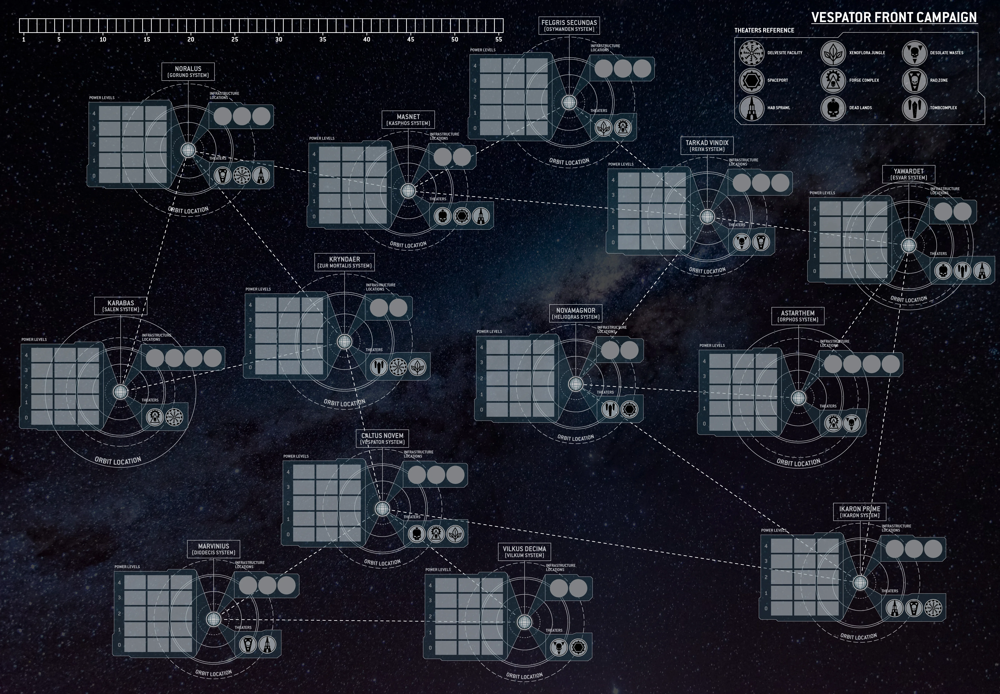

# 500 Миров - Война на Веспаторском фронте
Записи и журнал действий для кампании "500 Миров - Война на Веспаторском фронте" по Warhammer 40k  

### Быстрые переходы
- [Краткая вводная](#краткая-вводная)
- [Карта Веспаторского фронта](#карта-веспаторского-фронта)
- [Правила и фазы кампании](#правила-и-фазы-кампании)
- [Правила Крестового Похода](#правила-крестового-похода)
- [Кратко игрокам](#итого-кратко-игрокам)
- [Нюансы и другие заметки](#нюансы-и-другие-заметки)

# Альянсы и Игроки
### Империум
1.  [Максим](https://t.me/rorin_korfax)  - [Astra Militarum](https://wahapedia.ru/wh40k10ed/factions/astra-militarum/#Crusade-Rules)  :  [Боевые порядки](/orders-of-battle/order-of-battle-imperium-AM1.md)
2.  Азамат - [Astra Militarum](https://wahapedia.ru/wh40k10ed/factions/astra-militarum/#Crusade-Rules)  :  [Боевые порядки](/orders-of-battle/order-of-battle-imperium-AM2.md)
3.  Кирилл - [Dark Angels](http://wahapedia.ru/wh40k10ed/factions/space-marines/dark-angels#Crusade-Rules)  :  [Боевые порядки](/orders-of-battle/order-of-battle-imperium-DA.md)
### Хаос
1.  Даниил - [1000 Sons](http://wahapedia.ru/wh40k10ed/factions/thousand-sons/#Crusade-Rules)  :  [Боевые порядки](/orders-of-battle/order-of-battle-chaos-1000sons.md)
2.  Дмитрий - [Death Guard](http://wahapedia.ru/wh40k10ed/factions/death-guard/#Crusade-Rules)  :  [Боевые порядки](/orders-of-battle/order-of-battle-chaos-DG.md)
3.  Алексей - [Chaos Space Marines](http://wahapedia.ru/wh40k10ed/factions/chaos-space-marines/#Crusade-Rules)  :  [Боевые порядки](/orders-of-battle/order-of-battle-chaos-CSM.md)
### Остальные
1.  Артём - [Orks](http://wahapedia.ru/wh40k10ed/factions/orks/#Crusade-Rules)  :  [Боевые порядки](/orders-of-battle/order-of-battle-xenos-orks.md)
2.  Матвей - [Tau](http://wahapedia.ru/wh40k10ed/factions/t-au-empire/#Crusade-Rules)  :  [Боевые порядки](/orders-of-battle/order-of-battle-xenos-tau.md)
3.  Глеб - [Harlequins](https://wahapedia.ru/wh40k10ed/factions/aeldari/harlequins#Crusade-Rules)  :  [Боевые порядки](/orders-of-battle/order-of-battle-xenos-harlequins.md)

# Краткая вводная
## Кратко о грядущем
Cсылка на саму кампанию [Война на Веспаторском фронте (англ)](https://wahapedia.ru/wh40k10ed/the-rules/war-on-the-vespator-front)  
Представитель Администратума и Магистр Войны: [Макс (тг)](https://t.me/rorin_korfax) - демократично диктует решения самых спорных моментов вне рамкок, описанных в Lex Imperialis (правилах игры и описании кампании).  

Кампания начнётся с подготовки и первичной расстановки сил и далее продолжится в виде 6 фаз, которые в свою очередь разделены на последовательные шаги.  
Поле боя стратегического уровня представляет собой диаграмму связей и некоторых характеристик ключевых планет на Веспаторском фронте.  
Боевые операции будут проводиться по стандартным правилам WH40k, но миссии, деплой, условия и прочие особенности также могут быть переопределены обстоятельствами на стратегической карте Веспаторского фронта!  
Операции будут приносить влияние на планетах фронта и в конце фазы Очки Кампании вашему Альянсу.  
  
**Цель кампании: Ваш Альянс должен набрать больше Очков Кампании, чем другие Альянсы.**
  
Как ходить? В начале фазы все участники (желательно, но не обязательно, синхронизовавшись со своим Альянсом) сообщают выбранные операции своего флота/ов Магистру Войны.  
Далее, Магистр по результатам выбора формирует последовательность предстоящих действий и помогает составить расписание сражений.  
После всех сражений Магистр публикует результаты фазы и переходим к следующей фазе или финалу кампании.  

## Кратко про крузейд, опыт отрядов и прочее индивидуальное развитие  
Ссылкам на правила по Крестовым Походам [Crusade Rules](https://wahapedia.ru/wh40k10ed/the-rules/crusade-rules/)  

У каждого игрока под контролем находится флот, в рамках которого располагается его фракция, с различными возможностями, особенностями и представителями - это, в терминах Crusade'a называется Боевыми Порядками (Order of Battle). Все особенности, изменения, достижения и потери ваших Боевых Порядков будут отображаться в соответствующей карточке.
Вся совокупность доступных войск и боевых единиц в рамках Боевых Порядков называется Силы Крестового Похода (Crusade Force). Когда флот отправляет часть своих Силы Крестового Похода на проведение Операции (в сражение) - эта часть называется Армией Крестового Похода (Crusade Army), или просто Армией.  
*Стоит заметить, что Силы Крестового Похода могут включать в себя значительно больше очков доступных отрядов, чем стандартный размер Армии для проведения операции! Например, в Силах Крестового Похода со временем может быть 2500 очков отрядов, тогда как стандартый размер Армии установлен в 1000.*  
Каждый отряд в ваших Боевых Порядках также будет персонализирован и представлен отдельной карточкой, на которой будет вестись учёт его достижений, опыта, боевых шрамов и наград.
В ходе кампании, участвуя в операциях ваши Боевые Порядки будут зарабатывать Очки Крестового Похода и Доступную Реквизицию, при помощи которых вы сможете влиять на состав Сил Крестового Похода и отдельные особенности отрядов.
Подробнее в соответствующем разделе [ниже](#правила-крестового-похода).

Для торопыг и опытных Крестоносцев - все флоты начинают со следующими вводными для своих Боевых Порядков:  
Правила Крестового Похода [Рукава Нахмунда](https://wahapedia.ru/wh40k10ed/the-rules/nachmund-gauntlet) будут применяться в отношении Боевых Особенностей (Battle Traits), Реликвий (Crusade Relics), Благословлений (Crusade Blessings) и Боевых задач (Agendas). А также из этих правил будут работать правила [Чемпионов](https://wahapedia.ru/wh40k10ed/the-rules/nachmund-gauntlet/#Mighty-Champions) и [Высокоточной Высадки](https://wahapedia.ru/wh40k10ed/the-rules/nachmund-gauntlet/#Surgical-Deep-Strike).
Для конвертирования, также просто заменим SAP'ы на Очки Кампании, если таковые будут попадаться в правилах.  
Лимит Снабжения = 1000  
Доступная Реквизиция = 5 RP  
Размер Армий в сражениях первой фазы = не более 1000  

# Карта Веспаторского фронта
## Карта

## Легенда и пояснения к карте
У каждой планеты есть следующие ключевые свойства:
- Уровень Влияния каждого Альянса на этой планете (влияет на приоритет Альянса здесь и на общие Очки Кампании)
- знакоместа для построек Инфраструктуры (постройки приведены ниже)
- доступные театры действий (биомы и условия среды, влияет на условия Боевых Операций)
- орбита для размещения флотов (места хватит на всех, если что)
- связи с другими планетами (варп-маршруты и каналы астропатической связи)
Детали будут переведены и доступны ниже, либо по запросу в Администратум.

## Ссылка на логи каждой фазы
- Начало
- Фаза 1
- Фаза 2
- Фаза 3
- Фаза 4
- Фаза 5
- Фаза 6

# Правила и фазы кампании
Фаза кампании проходит в 5 последовательных шагов, приведенных ниже

## Первичная расстановка сил
Все дальнейшие действия будут проходить в следующем формате - каждый Альянс тайно решает, что где куда. Сообщает о своём решении Магистру Войны. После чего все решения одновременно раскрываются и реализуются одновремененн. Если есть спорные моменты в порядке действий, решает сначала соотношение Уровней Влияния Альянсов на планете. Если этого не достаточно Магистр Войны случайным образом определяет порядок.
1. Альянсы располагают свою Твердыню на одной из планет. Влияние этого Альянса на данной планете становится 4.  
   Альянс выбирает 3 планеты, где его Уровень Влияния становится 3.  
   Альянс выбирает 4 планеты, где его Уровень Влияния становится 2.  
   На остальных планетах его Уровень Влияния становится 1.  
2. Альянсы располагают 3 любых объекта Инфраструктуры на любых планетах.
3. Каждый игрок каждого Альянса располагает свой флот на орбите одной из планет.

## 1. Выбор операций
У каждого игрока есть один подконтрольный флот. В каждую фазу флот каждого игрока выберет и совершит 1 действие из нижеприеденного списка.  
Действия выбираются <ins>тайно</ins> и далее происходят в установленом порядке.[подробнее](#2-проведение-операций)  
Одноимённые операции происходят (чаще всего) "одновременно". Иногда, порядок и соответствующие результаты оказываются важны. Тогда порядок выполнения операций определяется Уровнем Влияния Альянсов на рассматриваемой планете. Дальнейшие споры решает Администратум.

<ins>Возможные варианты операций (кратко):</ins>
- Боевая операция (нападение на другой Альянс, собственно рубилово до крови, до смерти [подробнее](#детали-боевых-операций))
- Пустотный переход (передвижение флота игрока)
- Строительство инфраструктуры (постройка одного из "зданий" на планете рядом с флотом игрока, подробности также в отдельном разделе ниже)
- Операции логистической ауксилии (подготовка к предстоящему сражению;
- Специальные операции (попытка небольшого понижения влияния других Альянсов на планете рядом с флотом игрока без Боевой Операции)

> [!CAUTION]
> TODO обсудить вариант подготовки встречного сражения, например, при прибытии флота в систему или другого заранее оговоренного условия, для действия "Операции логистической ауксилии"

## 2. Проведение операций
Проведение выбраных операций проходит в следующем порядке:
- Раскрытие выбранных операций (все видят, что будут делать остальные и в каком порядке)
- Завершение строительства (все операции строительства завершаются и уже оказывают свои эффекты на дальнейшие события.  
  Первыми строятся объекты Альянсов, у которых выше Уровень Влияния на целевой планете. Если ещё остались незавершённые строительства, а мест для строительства на планете уже не осталось - начатая стройка отменяется без эффекта!)
- Реализации Боевых операций (происходит определённое количество сражений. см. Миссии и деплой, Театры боевых действий, Подготовка к сражению)
- Обработка результатов Боевых операций (см. Результаты сражения)
- ~Прибытие флотов (результат операций "Пустотный переход")~
- Низкое сопротивление (результат операции "Специальные операции", для каждого Альянса противника Магистр Войны бросает d6: на 5+ Уровень Влияния этого Альянса падает на 1 на данной планете)

> [!CAUTION]
> Вычеркнутые пункты снесены Администратумом, т.к. при их наличии получается, что за ход Альянсы могут путешествовать флотами практически без каких-либо ограничений. Это лишает смысла ведение карты и часть инфраструктурных объектов.  
> TODO Продумать аспект передвижения флотов. 

### Проведение Боевых операций
Порядок проведения [сражения на Веспаторском Фронте](https://wahapedia.ru/wh40k10ed/the-rules/war-on-the-vespator-front/#Vespator-Front-Mission-Sequence) + дополнения правилами сражений Крестового Похода [Рукава Нахмунда](https://wahapedia.ru/wh40k10ed/the-rules/nachmund-gauntlet/#Nachmund-Gauntlet-Crusade-Battles)
1. *Прочтите миссию*
2. Определите размер сражения
3. *Соберите Армию*
4. Расположите маркеры целей
5. *Определите условия и правила сражения (Theatre Twist)*
6. *Создайте поле боя (террейн)*
7. Определите атаующую и защищающуюся стороны  
С1. *Приобретите Реквизиции (RP)*  
С2. *Получите Боевые задачи (Agendas)*  
С3. *Получите Благословления (Crusade Blessings)*  
9. Объявите Боевые Формации (кто кого ведёт, кто в каком транспорте, в deep strike...)
10. Задеплойте армии
11. Редеплой
12. Определите, кто первый ходит
13. Реализуйте правила "перед сражением"
14. Начните сражение
15. Завершите сражение
16. Определите победителя  
С4. *Внесите изменения в карточки Отрядов*  
С5. *Внесите изменения в карточку Боевых Порядков*  
18. *Определите результат операции*

Как видите, порядок проведения сражений не сильно отличается от классического порядка проведения сражений в Wh40k. Те пункты, которые нуждаются в пояснении и проводятся не стандартно - будут приведены ниже.

#### 1. Миссии 
> [!CAUTION]
> TODO Миссии

#### 3. Соберите Армию
В первой фазе размер Армии в сражениях = 1000 очков. Для дальнейших фаз, размер Армии растёт на 200 очков каждую фазу (т.е. 1200 для 2й фазы, 1400 для 3й фазы, и т.д.).

#### 5. Определите условия и правила сражения (Theatre Twist)
При сражениях на различных планетах [условия сражения](https://wahapedia.ru/wh40k10ed/the-rules/war-on-the-vespator-front/#Theatres-of-the-Five-Hundred-Worlds) будут сильно отличаться. В некотоых случаях один из игроков сможет выбрать один из доступных на планете биомов. В противном случае, условия будут определяться случайно. Выбор театра повлияет на предпочтительные варианты расстрановки террейна, а также перед самым сражением внесёт дополнительные условия в правила сражения (Theatre Twist).  
Всего есть 9 различных театров боевых действий:
- [Космопорт](https://wahapedia.ru/wh40k10ed/the-rules/war-on-the-vespator-front/#Spaceport)
- [Степные пустоши](https://wahapedia.ru/wh40k10ed/the-rules/war-on-the-vespator-front/#Desolate-Wastes)
- [Джунгли ксено-флоры](https://wahapedia.ru/wh40k10ed/the-rules/war-on-the-vespator-front/#Xenoflora-Jungle)
- [Зона рад-заражения](https://wahapedia.ru/wh40k10ed/the-rules/war-on-the-vespator-front/#Rad-Zone)
- [Кузнечный комплекс](https://wahapedia.ru/wh40k10ed/the-rules/war-on-the-vespator-front/#Forge-Complex)
- [Жилые блоки / Трущобы](https://wahapedia.ru/wh40k10ed/the-rules/war-on-the-vespator-front/#Hab-Sprawl)
- [Горнодобывающий карьер](https://wahapedia.ru/wh40k10ed/the-rules/war-on-the-vespator-front/#Delvesite-Facility)
- [Мёртвые земли](https://wahapedia.ru/wh40k10ed/the-rules/war-on-the-vespator-front/#Dead-Lands)
- [Комплекс гробниц](https://wahapedia.ru/wh40k10ed/the-rules/war-on-the-vespator-front/#Tomb-Complex)

#### 6. Создайте поле боя (террейн)
Также как на условия сражения, Театры боевых действий влияют и на характер и плотность террейна. Эти особенности также приведены в описаниии театров боевых действий.

#### С1. Приобретите Реквизиции (RP)  
Некоторые варианты Реквизиции предоставляют возможность их приобретения прямо перед сражением (например, срочная замена отрядов в Боевых Порядках). Так вот - это тот самый момент, когда это можно сделать в последовательности проведения сражения.

#### С2. Получите Боевые задачи (Agendas)  
> [!CAUTION]
> TODO Боевые задачи (Agendas)

#### С3. Получите Благословления (Crusade Blessings)  
> [!CAUTION]
> TODO Благословления (Crusade Blessings)

#### С4 и С5. Внесите изменения в карточки Отрядов и Боевые Порядки
> [!CAUTION]
> TODO Опыт, Награды

> [!CAUTION]
> TODO Выведенные из строя + Шрамы Отряда

#### 18. Определите результат операции
> [!CAUTION]
> TODO другие результаты сражения

## 3. Результаты операций и дальнейшие события
Обработка результатов всех Боевых Операций (учёт результатов Боевых операций и их взаимовлияние).  
В этот момент, Магистр Войны подсчитывает суммарный Уровень Влияния каждого Альянса на всех планетах фронта. Далее, к этому числу добавляется 3, если Твердыня Альянса не разрушена. Полученное число добавляется к уже полученным Очкам Кампании соответствующего Альянса.  
  
**События на Веспаторском фронте**  
Также, кроме результатов Боевых Операций будет происходить ещё одно или несколько независимых от действий игроков событий.[правила](https://wahapedia.ru/wh40k10ed/the-rules/war-on-the-vespator-front/#Vespator-Front-Events)  
Так, если один из Альянсов в этот момент имеет на 5 Очкам Кампании больше, чем каждый другой Альянс - этот Альянс называется *доминирующим* и с вероятностью 4+ на d6 происходит событие из списка "Превратности Власти".
> [!TIP]
> пример события из списка: Открытая Книга - в следующей фазе кампании, игроки данного Альянса должны в открытую выбрать свои операции до всех остальных игроков
 
Далее, если один из Альянсов в этот момент имеет на 5 Очкам Кампании меньше, чем каждый другой Альянс - этот Альянс называется *отстающим* и c вероятностью 4+ на d6 происходит событие из списка "Отчаянные Меры".
> [!TIP]
> пример события из списка: Дерзкое Рвение - каждый игрок отстающего Альянса может выбрать и выполнить одну дополнительную операцию  

После чего, с вероятностью 4+ на d6 для фаз 1-3 или 3+ на d6 для фаз 4-6, происходит событие из списка "Судьбы Войны".
> [!TIP]
> пример события из списка: Пустотное Пиратство - в следующей фазе флоты не могут заявить операцию Пустотный переход и вся инфраструктура типа Объект Поддержки не оказывют никакого эффекта

Все броски и регистрацию результатов Администратум выполнит "за кулисами" и занесёт в журнал, доступный всем.

## 4. Передвижение флотов
Прибытие флотов (флоты, выполнявшие операцию Пустотный переход прибывают в назначеное место без варп инцидентов)
 
## 5. Постройка инфраструктуры
На этом шаге каждый Альянс в порядке убывания суммарного Уровня Влияния выбирает 1 планету, где есть свободные места для строительства. На этих планетах немедленно строится один объект Инфраструктуры на выбор соответствующего Альянса.

### Виды построек Инфраструктуры
Каждый Альянс может иметь ограниченное количество построек 4 типов.

#### Твердыня (макс 1 на Альянс)  
  
Каждый раз, когда игрок, входящий в Альянс, владеющий этой Инфраструктурой, выигрывает битву на этой планете или на планете связанной с этой, он может считать Уровень Влияния своего Альянса на этой планете как на 1 выше или ниже, чем он есть на самом деле, для целей расчета результатов этой битвы.  
Пока Твердыня Альянса не разрушена, она также будет оказывать влияние на учёт в общем количестве Очков Кампании, набираемых этим Альянсом.

#### Перевалочные Пункты (макс 3 на Альянс)
  
Каждый раз, когда игрок, входящий в Альянс, владеющий этой Инфраструктурой, участвует в битве на этой планете или на планете связанной с этой, он может считать Уровень Влияния своего Альянса на этой планете на 1 выше или ниже, чем он есть на самом деле, для целей правил миссии этой битвы. Эффект от нескольких Перевалочные Пунктов не суммируется (поэтому может сработать только один раз в каждой битве).  

#### Объект Поддержки (макс 3 на Альянс)
  
Для игроков, входящий в Альянс, владеющий этой Инфраструктурой, планеты, находящиеся на расстоянии 2 от этой планеты, считаются связанными с ней, но не наоборот. (*прим.переводчика: Т.е. с этой планеты доступны планеты на расстоянии 2 перехода, но эта планета всё также доступна только для планет на расстоянии 1, если нет других, похожих улучшений*).  

#### Линия Укреплений (макс 5 на Альянс)
  
Минимальный Уровень Влияния Альянса, владеющего этой Инфраструктурой на данной планете увеличивается на 1. При строительстве этой Инфраструктуры, если она повышает минимальный Уровень Влияния своего Альянса выше текущего Уровня Влияния на данной планете, Уровень Влияния увеличивается соответствующим образом. Каждый раз, когда правило снижает Уровень Влияния этого Альянса ниже этого минимального значения - вместо этого уничтожается одна из Линий укреплений этого Альянса на данной планете.

#### Уничтоженное место постройки
  
В некоторых случаях (например, в результате боевой Операции) на планете может быть уничтожен не только сам Инфраструктурный Объект, но и разрушено место его постройки. В таком случае, на этом месте более ничего нельзя построить.  
Более того, есть на планете не осталось пригодных мест для строительства - Уровень Влияния каждого Альянса для этой планеты опускаются до 0. Тем не менее, флоты всё также могут располагаться на её орбите.

# Правила Крестового Похода
Ссылки:  
[Общие правила по Крестовым Походам - Crusade Rules](https://wahapedia.ru/wh40k10ed/the-rules/crusade-rules/)  
[Правила по Рукаву Нахмунда - Nachmund Gauntlet Crusade](https://wahapedia.ru/wh40k10ed/the-rules/nachmund-gauntlet)  

## Общие положения
У каждого игрока под контролем находится флот, в рамках которого располагается его фракция, с различными возможностями, особенностями и представителями - это, в терминах Crusade'a называется Боевыми Порядками (Order of Battle). Все особенности, изменения, достижения и потери ваших Боевых Порядков будут отображаться в соответствующей карточке[пустая карточка Боевых Порядков](https://wahapedia.ru/wh40k10ed/the-rules/crusade-rules/BlankOrderOfBattle.pdf).
Вся совокупность доступных войск и боевых единиц в рамках Боевых Порядков называется Силы Крестового Похода (Crusade Force). Когда флот отправляет часть своих Силы Крестового Похода на проведение Операции (в сражение) - эта часть называется Армией Крестового Похода (Crusade Army), или просто Армией.  
> [!NOTE]
> Стоит заметить, что Силы Крестового Похода могут включать в себя значительно больше очков доступных отрядов, чем стандартный размер Армии для проведения операции! Например, в Силах Крестового Похода со временем может быть 2500 очков отрядов, тогда как стандартый размер Армии установлен в 1000.
  
Каждый отряд в ваших Боевых Порядках также будет персонализирован и представлен отдельной карточкой[пустая карточка Отряда](https://wahapedia.ru/wh40k10ed/the-rules/crusade-rules/BlankCrusadeCards.pdf), на которой будет вестись учёт его достижений, опыта, боевых шрамов и наград.
В ходе кампании, участвуя в операциях ваши Боевые Порядки будут зарабатывать Очки Крестового Похода и Доступную Реквизицию, при помощи которых вы сможете влиять на состав Сил Крестового Похода и отдельные особенности отрядов.

## Стартовые вводные
Правила Крестового Похода [Рукава Нахмунда](https://wahapedia.ru/wh40k10ed/the-rules/nachmund-gauntlet) будут применяться в отношении Боевых Особенностей (Battle Traits), Реликвий (Crusade Relics), Благословлений (Crusade Blessings) и Боевых задач (Agendas). А также из этих правил будут работать правила [Чемпионов](https://wahapedia.ru/wh40k10ed/the-rules/nachmund-gauntlet/#Mighty-Champions) и [Высокоточная Высадка](https://wahapedia.ru/wh40k10ed/the-rules/nachmund-gauntlet/#Surgical-Deep-Strike).  
Для конвертирования, также просто заменим SAP'ы на Очки Кампании, если таковые будут попадаться в правилах.  
Лимит Снабжения = 1000  
Доступная Реквизиция = 5 RP  
Размер Армий в сражениях первой фазы = не более 1000  

## Боевые Порядки (карточки, правила, особенности)
Здесь будет учитываться все особенности вашего флота в рамках данной кампании.
В карточке Боевых Порядков вы должны указать и отслеживать:
- Название вашего флота
- Лимит Снабжения (Supply Limit; максимальное количество очков ваших Сил Крестового Похода)
- Текущее Снабжение (Supply Used; суммарное количество очков ваших Сил Крестового Похода в отрядах, улучшениях и изменениях; не может превышать Лимит Снабжения)
- Боевой Счёт (Battle Tally; количество битв, в которых Армии из данных Боевых Порядков приняли участие - победили или проиграли)
- Счёт Побед (количество битв, в которых Армии из данных Боевых Порядков одержали победу)
- Доступная Реквизиция (Requisition Points, RP; см [ниже](#реквизиция-rp))
- Список отрядов (Название отряда, количество XP отряда, количество Очков Крестового Похода у отряда)
- Пометки (фракционные и другие особые достижения, награды, штрафы и т.д. - весь исторический багаж, нажитый коллективными усилиями всех участников данных Боевых Порядков)  

### Реквизиция (RP)
Реквизиция позволяет влиять на состав Сил Крестового Похода, их вооружение, количество моделей, встроенные улучшения (Enhancement'ы), лечение Боевых Шрамов (Battle Scars) и присвоение отряду Легендарного статуса.  
- Увеличение Снабжения (1 RP) = +200 очков к Силам Крестового Похода (не Армии!)  
- Почитаемые Герои (1-3 RP) = добавить любое доступное вашей фракции (из любого детача) улучшение (Enhancement'ы) одному из ваших Персонажей (Character), который был только что добавлен в Боевые Порядки или получил новый ранг (заменяет при этом получение Награды Отряда). Очки его стоимости пересчитаются соответственно. Стоит на 1 RP больше за каждое имеющееся улучшение в Боевых Порядках до максимума в 3 RP.  
- Легендарные Ветераны (3 RP) = присвоить отряду с 30 XP особый статус и позволить ему развиваться дальше ранга "Закалённый".  
- Перевооружение (1 RP) = перевооружить отряд, изменить состав его вооружения.  
- Починка и Восстановление (1-5 RP) = удалить один Боевой Шрам (Battle Scar) с одного отряда.  
- Свежие Рекруты (1-4 RP) = увеличить отряд, согласно правилам его карточки (например, у вас в Силах был отряд пехоты из 10 моделей, но у него есть возможность иметь 15 или 20 моделей. Этим действием вы можете увеличить данный отряд для следующиего набора в Армию до, напрмиер, 20 моделей)  
- ??? (? RP) = в правилах Крестового Похода для вашей фракции есть раздел с Реквизицией, специфичной для вашей фракции. Там уж смотрите сами.  

Никакие из вышеперечисленных действий не могут привести к превышению Лимита Снабжения ваших Боевых Порядков.
Боевые Порядки никогда не могут иметь более не использованых 10 RP.  
Получать RP можно (и нужно) следующими путями:  
- В конце сражения каждый участник получает 1 RP, вне зависимости от исхода сражения
- В результате успешного выполнения Боевых Задач (Agenda), вы можете получить некоторое количество RP, как это сказано в описании Боевой Задачи.
- В результате применения других спец правил, которые, например, могут быть описаны в правилах Крестового Похода вашей фракции, или других схожих правилах (о которых я пока не знаю, но скоро узнаю).

## Отряды (карточки, правила, особенности)
Здесь будет учитываться все особенности отряда, которому посвящена данная карточка. В ней должны учиываться следуюшие особенности:
- Название отряда (номер, кличка, имя персонажа, etc)
- Опыт Отряда (Experience Points, XP; см [ниже](#опыт-отряда-xp))
- Очки Крестового Похода Отряда (Crusade Points, CP; cвоеобразная мера силы отряда. Со старта 0, но увеличивается с получением опыта, улучшений и прочих действий в рамках кампании.)
- Состав отряда (количество и состав моделей в отряде, их вооружение и выбранные опции)
- Улучшения отряда (различные улучшения, полученные отрядом в ходе кампании)
- Общая стоимость отряда (очки для составления Армий. В результате улучшений, например, отряд может стоить дороже своей стандартной стоимости)
- Статистика Отряда (количество сражений, в которых участвовал отряд; количество победных сражений, в которых участвовал отряд; количество отрядов, уничтоженных данным отрядом)
- Награды и Шрамы Отряда (Battle Honours, Battle Scars; см. ниже)
- Прочие отметки (ролевые пометки, прочие неожиданные пометки про отряд)

> [!WARNING]
> При добавлении отрядов в Боевые Порядки НЕ разрешается использовать отряды из легенд!

> [!NOTE]
> Обратите внимание, что мы будем использовать правила [Чемпионов](https://wahapedia.ru/wh40k10ed/the-rules/nachmund-gauntlet/#Mighty-Champions) из правил по Рукаву Нахмунда. Это даёт возможность немного разнообразить ваших персонажей с тэгом EPIC HERO, добавив одному из них особую способность в рамках Крестового Похода.

### Опыт Отряда (XP)
В ходе сражений ваши отряды могут различными способами получать XP. В зависимости от уровня опыта отряда, он меняет свой статус. Это вляет на доступность некоторых Боевых Особенностей и прочих улучшений.  
- Боевой Опыт (Battle Experience): отряд получит 1 XP за участие в сражении в конце этого сражения
- Торговцы Смертью (Dealers of Death): отряд получит 1 XP за каждый 3й уничтоженный отряд в конце сражения. Эффект накопительный!
- Отмеченные Величием (Marked for Greatness): в конце каждого сражения один из отрядов каждой Армии может быть Отмечен Величием и получит доп. 3 XP
> [!TIP]
> Эффект Торговцев Смертью накопительный, соответственно, если отряд Х в первом сражении уничтожил 4 отряда, он получит в результате 1 доп.XP от этого правила. Допустим также этот же отряд Х в своём втором сражении он уничтожил ещё 2 отряда. Тогда по результатам второго сражения он получит по этому правилу уже 2 доп.XP! И так далее...
  
В дополнение к этим стандартным способам, есть различные нестандартные правила, влияющие на получение опыта отрядами (вроде выполнения Боевых Задач, например).
Стоит также отметить, что отряды с тэгами EPIC HERO, FORTIFICATION, SWARM, а также Призванные отряды и Отряды Замены.  

Получая опыт в ходе кампании, отряды со временем повышают свой Ранг (rank):  
- Новобранец (Battle-ready, 0-5 XP)
- Обстреляный (Blooded, 6-15 XP)
- Закалённый (Battle-hardened, 16-30 XP)
- Героический (Heroic, 31-50 XP)
- Легендарный (Legendary, 51+ XP)
Ранги выше Закалённого (и соответственно опыт более 30 XP) могут получать только Персонажи (CHARACTER) и отряды, получившие Реквизицию "Легендарные Ветераны".

### Награды Отряда
С каждым получением нового звания, отряд получает возможность получить одну Награду Отряда на ваш выбор - Боевые Особенности, Модификации Оружия или Реликвии.  
**Боевые Особенности (Battle Traits)**  
Особенности отряда, согласно его тэгов, описаны в разделе [Боевых Особенностей](https://wahapedia.ru/wh40k10ed/the-rules/nachmund-gauntlet/#Battle-Traits) правил Крестового Похода Рукава Нахмунда. Также, в правилах Крестового Похода вашей фракции наверняка есть раздел, посвящённый данной теме.  
**Модификации Оружия (Weapon Modifications)**  
Модификации Оружия описаны в [соответствующем разделе](https://wahapedia.ru/wh40k10ed/the-rules/crusade-rules/#Weapon-Modifications) общих правил по Крестовым Походам  
**Реликвии (Crusade Relics)**  
Правила по Реликвиям описаны в [соответствующем разделе](https://wahapedia.ru/wh40k10ed/the-rules/crusade-rules/#Crusade-Relics) общих правил по Крестовым Походам и в разделе [Реликвий](https://wahapedia.ru/wh40k10ed/the-rules/nachmund-gauntlet/#Crusade-Relics) правил Крестового Похода Рукава Нахмунда. Также, в правилах Крестового Похода вашей фракции наверняка есть раздел, посвящённый данной теме.  
> [!CAUTION]
> Обратите внимание, что мы используем только общие правила для всех фракций.
> TODO Будут ли использованы в данной кампании фракционные Crusade Blessings правил Крестового Похода Рукава Нахмунда - вопрос на обсудить? Т.к. для Империума их придётся немного сконвертировать.
> Предложение описано в разделе [Фракционные Благословления Крестового Похода](#фракционные-благословления-крестового-похода-faction-crusade-blessings)

### Шрамы Отряда
Когда отряд, в результате его уничтожения в сражении, проваливает проверку Выведенные Из Строя - он по вашему выбору либо теряет одну из имеющихся у него наград, либо получает случайный Шрам. Шрамы описаны в [соответствующем разделе](https://wahapedia.ru/wh40k10ed/the-rules/crusade-rules/#Battle-Scars) общих правил по Крестовым Походам.

### Сборные отряды (Attached Units)
[Правила по сборным отрядам в рамках Крестового Похода](https://wahapedia.ru/wh40k10ed/the-rules/crusade-rules/#Attached-Units).  
Сборный отряд получает все Награды и Шрамы Отряда как от всех отрядов Лидеров(Leader), так и от отряда Телохранителя (Bodyguard). Исключение составляют правила, распространяющиеся на отдельную модель или на конкретные тэги (которые по разным причинам могут не распространиться на весь Сборный отряд).  
В случае уничтожения какого-либо отряда, в конце сражения, уничтоженный отряд будет проходить проверку Выведения из Строя только в отношении себя.
> [!TIP]
> Например, был отряд кадианцев (Bodyguard) с командником (Leader). В ходе сражения все модели командника погибли, а основной отряд остался. В этом случае проверку Выведения из Строя будет проходить только командник отряд. Её результаты отразятся в его карточке Отряда (возможным Шрамом, например)

Также отдельно, в индивидуальном порядке отряды будут получать XP в конце сражения. Это значит, что каждый отряд отдельно получит 1 XP за сражение. Но остальные, бонусные XP за выполнение Боевых задач (Agendas) или за изменение статистики отряда (Combat tallies) получит только один из отрядов, составляющих Сборный отряд (либо Leader, либо Bodyguard, но не оба!)

## Итого, кратко игрокам
Вам придётся самостоятельно вести карточки ваших Боевых Порядков и Отрядов, а также принимать решения, как развивать отряды.  
А значит у вас должны быть 1 карточка ваших Боевых Порядков и по 1 карточке Отряда для каждого юнита ваших Сил Крестового Похода.  
Составьте ростер на 1000 очков, как обычно вы бы собирались поиграть в классический Wh40k.
После чего, вы составляете карточку Боевых Порядков(типа, общее описание вашей армии) и на каждый отряд - Карточку Отряда[пример](/orders-of-battle/order-of-battle-default.md).
Каждый отряд начинает с 0 XP и 0 CP, без наград, шрамов и прочих таких отметок - всё по default'у, так сказать. Но вы можете потратить RP (со старта у вас их 5 на все Боевые Порядки) в некоторых случаях, чтобы сразу немного улучшить некоторые свои отряды.  
Магистр Войны будет подсказывать и напоминать, когда стоит уделить этому время, но все мы люди-человеки, а значит - в первую очередь следите сами за своим огородом. А ещё лучше - не только себе, но и ближнему помогите. Так мир станет лучше, чище и добрей. Так Победим!
Все изменения в этих карточках следует сообщать Представителю Администратума, чтобы они были учтены и занесены в лог кампании.  
Также по ходу кампании, чаще всего при наступлении очередной фазы, все участники будут собираться и решать, какие глобальные действия будут предпринимать их флоты и альянсы. Это всё далее будет отображено на карте фронта.
Для облегчённого заполнения и ведения Карточки Боевых Порядков можно воспользоваться [заготовкой](/orders-of-battle/order-of-battle-default.md).

# Нюансы и другие заметки
## Конвертирование правил Крестового Похода Рукава Нахмунда
Правила Крестового Похода [Рукава Нахмунда](https://wahapedia.ru/wh40k10ed/the-rules/nachmund-gauntlet) будут применяться в отношении
- Боевых Особенностей (Battle Traits)
- Реликвий (Crusade Relics)
- Благословлений (Crusade Blessings)
- Боевых задач (Agendas)
- Правила [Чемпионов](https://wahapedia.ru/wh40k10ed/the-rules/nachmund-gauntlet/#Mighty-Champions)
- Правила [Высокоточная Высадка](https://wahapedia.ru/wh40k10ed/the-rules/nachmund-gauntlet/#Surgical-Deep-Strike)  

Для конвертирования, также просто заменим SAP'ы на Очки Кампании, если таковые будут попадаться в правилах.  

### Фракционные Благословления Крестового Похода (Faction Crusade Blessings)
Для Альянса Империума Фракционное Благословления влияет на правило, которое очень сложно прикрутить к текущей кампании.  
Потому предложу вариант, оказывающий аналогичное действие, но в рамках стандартных правил.  
***До конца второго хода противника игрока за фракцию Империума вражеские отряды, прибывающие из Резервов противника, не могут быть расположены ближе 12" к отрядам и зоне расстановки игрока за фракцию Империума.***  
Остальные Фракционные Благословления Крестового Похода предлагаю оставить без изменений

### Правила Чемпионов (Mighty Champions)
Один из отрядов в ваших Боевых Порядках с тэгов EPIC HERO, в момент его добавления в Боевые Порядки, может получить одну из перечисленных в правилах Крестового Похода Рукава Нахмунда способностей.  
Также, получив эту способность, этот отряд получает 1 CP, не смотря на то, что он иными способами не может получать их!
Получить способность по правилу Чемпионов может <ins>только один</ins> отряд в Боевых Порядках.

### Правила Высокоточная Высадка (Surgical Deep Strike)
При высадке из Резервов с использованием способности Высадка (Deep Strike), отряды могут высаживаться не в 9", согласно способности, а ближе - начиная с 6" от всех вражеских отрядов. Но есть нюанс...  
При таком варианте высадки, после расстановки отряда, в зависимости от количества моделей противника, находящихся в 9" от высадившегося отряда, проходится проверка по соответствующей таблице. И если она провалена, то с отрядом может случиться разной степени беда - от Battle Shock'a, до некоторого количества mortal wound'ов, или даже комбинации из обеих бед и доп преимуществ противнику (см. соответствующие таблицы в правилах).  
Правила, запрещающие расположение Подкреплений ближе, чем в 12" работают и в данном случае как обычно.
> [!WARNING]
> Изначально, в правилах по [Высокоточная Высадка](https://wahapedia.ru/wh40k10ed/the-rules/nachmund-gauntlet/#Surgical-Deep-Strike) сказано, что высадка может происходить не ближе чем в 3", но уже давняя эррата от GW правит дистанцию с 3" на 6" во всех возможных правилах и документации. Будье осторожны и предельно внимательны при орбитальной высадке с гравишутом!  
